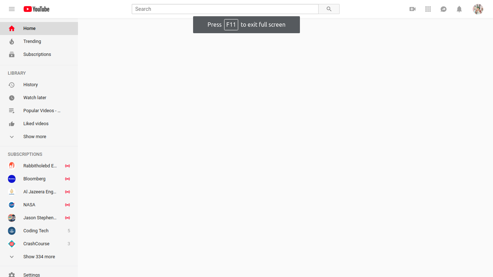
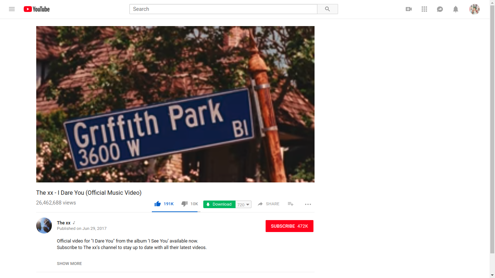

## A Chrome extension to hide all unnecessary videos recommended by Youtube and watch only what you search for. 

## How to Install: 

### On Chrome
- At first, download the extension. Click "Clone or Download" and then "Download as Zip". Extract the compressed files in a folder and then do as shown in the video: 

- [https://www.youtube.com/embed/CmXJOWeecvc](https://www.youtube.com/embed/CmXJOWeecvc)

### On Firfox: 
- Just visit [Firefox add on store](https://addons.mozilla.org/en-US/firefox/addon/youtube-research-mode/) and insall

## Screenshots: 

#### Homepage (contains nothing except search box and navigations):

#### Video View Page (contains no other recommended videos):
